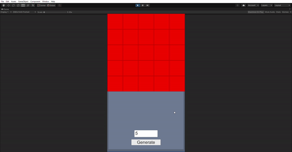

Github Repo for Gameguru Internship Case-1

**Introduction**

I had to create a grid of n*n. Every cell have to be a Sprite. I only used UI Components for getting an input for "n" and generating a new grid.
I written two scripts GridMaster and GridItem. GridItem script is on every Grid Cell Sprite and GridMaster is on the parent GameObject. GridItem script stores whether that cell is clicked and the neighboors of the cell in a List<GameObject> called matches.

GridMaster checks for any clicked objects with more than one neighboor, adds that cell and the neighboor of its neighboor into a list called matchingcell. And when the count of matching cell is larger than 3 it destroys the x'es.

